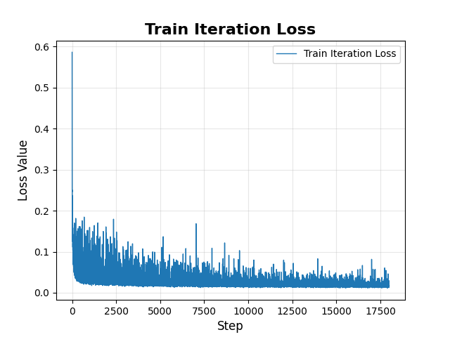
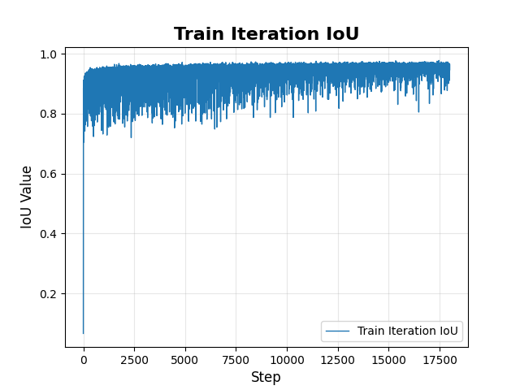
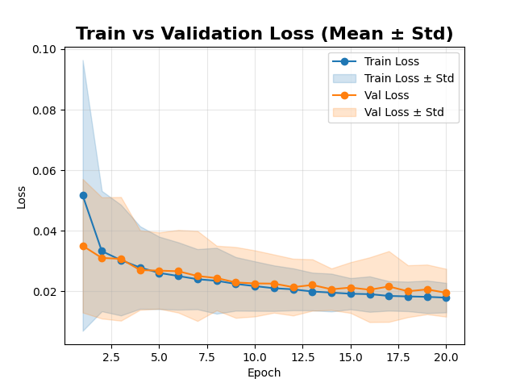
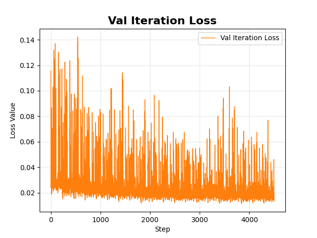
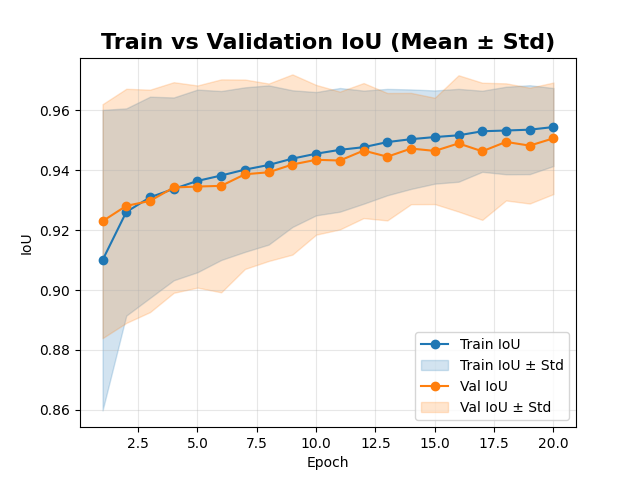
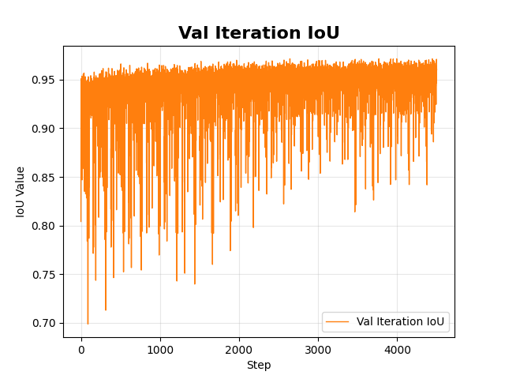

# Fish-Segmentation-DINOv3
DINOv3-based semantic segmentation pipeline for large-scale fish datasets. Includes data loading, preprocessing, model inference, training, evaluation, and advanced visualization of segmentation results.

## 📊 Training Curves

### 🔹 Train Iteration Loss

### 🔹 Train Iteration IoU

### 🔹 Train vs Validation Loss (Mean ± Std)

### 🔹 Validation Iteration Loss

### 🔹 Train vs Validation IoU (Mean ± Std)

### 🔹 Validation Iteration IoU

---

## 🎲 Random Predictions (20 Samples)

---

## 🥇 Best 5 Predictions (IoU top 5)

---

## ⚠️ Worst 5 Predictions (IoU bottom 5)

