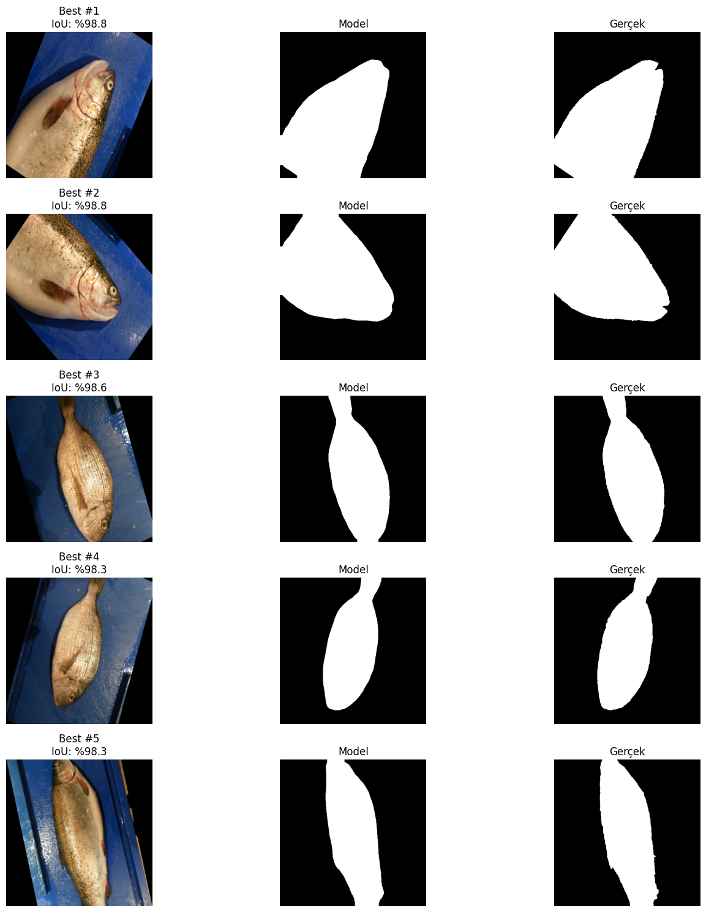
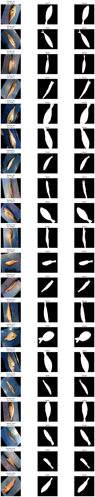

# 🐟 Fish-Segmentation-DINOv3

[](https://pytorch.org/)
[](https://opensource.org/licenses/MIT)
[](https://www.kaggle.com/datasets/crowww/a-large-scale-fish-dataset)

> **State-of-the-art semantic segmentation on the "Large-Scale Fish Dataset" achieving 95%+ IoU using a frozen DINOv3 Vision Transformer backbone.**

---

## 📖 Overview

This repository implements a complete semantic segmentation pipeline leveraging **Meta AI’s DINOv3 Vision Transformer**. By utilizing a **frozen self-supervised backbone** paired with a lightweight CNN decoder, this project demonstrates that massive compute resources are not required to achieve pixel-perfect segmentation on complex, real-world biological data.

**Key Highlights:**
* **IoU:** ~98.8% on best cases (Mean >95%).
* **Efficiency:** Trains in just 20 epochs with a lightweight decoder.
* **Robustness:** Handles extreme rotations, lighting glares, and species variations.

---

## ⚙️ Architecture

The model utilizes a **Transfer Learning** approach. We freeze the powerful DINOv3 backbone to leverage its global feature representations and only train a lightweight decoder to map those features to segmentation masks.

```mermaid
graph TD;
    A[Input Image 448x448] -->|Frozen Weights| B[DINOv3 ViT Backbone];
    B -->|Patch Embeddings| C[Reshape to Grid H/16 x W/16];
    C -->|Feature Map| D[Lightweight 3-Layer CNN Decoder];
    D -->|Upsample| E[Segmentation Mask 1xHxW];
    style B fill:#f96,stroke:#333,stroke-width:2px
    style D fill:#61dafb,stroke:#333,stroke-width:2px
````

| Component | Specification |
| :--- | :--- |
| **Backbone** | `facebook/dinov3-vits16-pretrain-lvd1689m` (Frozen) |
| **Decoder** | Custom 3-Layer CNN |
| **Input Size** | 448 $\times$ 448 |
| **Optimizer** | AdamW |
| **Loss Function** | BCEWithLogitsLoss |

-----

## 📂 Dataset

We utilize the **[A Large-Scale Fish Dataset](https://www.kaggle.com/datasets/crowww/a-large-scale-fish-dataset)** from Kaggle.

  * **Size:** \~9,000 Images
  * **Ground Truth:** Pixel-accurate binary masks (`ClassName GT`)
  * **Challenges:** The dataset features significant variance in fish orientation, diverse background plates, and specular reflections (glare).

-----

## 📊 Performance & Results

### Quantitative Metrics

The model achieves rapid convergence, stabilizing around **Epoch 15**.

| Metric | Value (Mean ± Std) |
| :--- | :--- |
| **Training IoU** | **0.954** ± 0.02 |
| **Validation IoU** | **0.951** ± 0.03 |
| **Best Single Prediction** | **0.988** |

### 📈 Training Visualizations
<p align="center">
<b>Step-level Metrics</b><br>


</p>

<p align="center">
<b>Epoch-level Comparisons (Mean ± Std)</b><br>


</p>

<p align="center">
<b>Validation Stability</b><br>


</p>

-----


## 🖼️ Qualitative Results

#### 🥇 Top 5 Predictions (Best Case)

The model achieves nearly perfect overlap (IoU \~98%+) on these examples, capturing fine details of fins and tails.

#### 🎲 Random Batch (Generalization Check)

A random sample of 20 images showing the model's robustness across different species and background colors.

#### ⚠️ Bottom 5 Predictions (Failure Cases)

Performance drops (IoU \~56-79%) typically occur due to extreme occlusion, heavy glare, or ambiguous labeling in the ground truth.

-----

<p align="center">
<b>🥇 Best Predictions (IoU ~98%+)</b> &nbsp;&nbsp;&nbsp;&nbsp; <b>⚠️ Failure Cases (Worst)</b><br>
 
</p>

<p align="center">
<b>🎲 Random Batch (Generalization Check)</b><br>

</p>

> *Top row: Side-by-side comparison of the **Best** results vs. **Failure Cases** (mostly due to glare/occlusion). Bottom row: A **Random** batch showing general model performance.*
> *The visualization above compares the **Best** performing masks (left) against a **Random** batch (right). The bottom row highlights **Failure Cases**, mostly due to extreme glare or occlusion.*


## 🛠️ Installation

Clone the repository and install the dependencies.

```bash
git clone [https://github.com/ColdVI/Fish-Segmentation-DINOv3](https://github.com/ColdVI/Fish-Segmentation-DINOv3)
cd Fish-Segmentation-DINOv3

# It is recommended to use a virtual environment
python -m venv venv
source venv/bin/activate  # On Windows use: venv\Scripts\activate

pip install -r requirements.txt
```

-----

## 🚀 Usage

### 1\. Training

To train the model from scratch using the Kaggle dataset:

```bash
python src/train.py \
    --data-root "/path/to/fish_dataset/Fish_Dataset/Fish_Dataset" \
    --epochs 20 \
    --batch-size 8 \
    --image-size 448
```

### 2\. Evaluation

To run inference on the validation set and generate plots:

```bash
python src/train.py --eval-only
```

-----

## 📦 Directory Structure

```plaintext
Fish-Segmentation-DINOv3/
├── notebooks/          # Jupyter Experimentation
│   └── DINOv3_Fish_Segmentation_Final.ipynb
├── src/                # Source Code
│   ├── dataset.py      # Custom Torch Dataset class
│   ├── model.py        # ViT Backbone + CNN Decoder Architecture
│   └── train.py        # Training Loop & Eval Script
├── plots/              # Generated Metrics & Visualizations
│   ├── 1_Train_Iteration_Loss.png
│   ├── 2_Train_Iteration_IoU.png
│   ├── ...
│   └── Unknown-10.png  # Best predictions
├── outputs/            # Model Checkpoints (.pth)
└── README.md
```

-----

```
```
